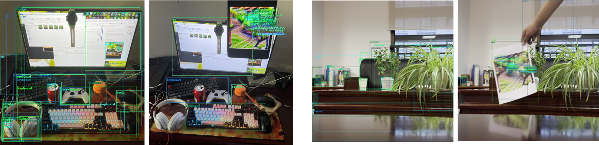
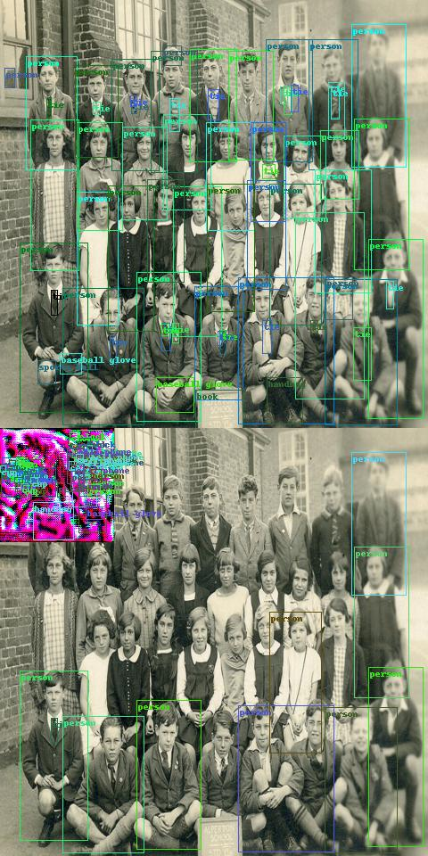
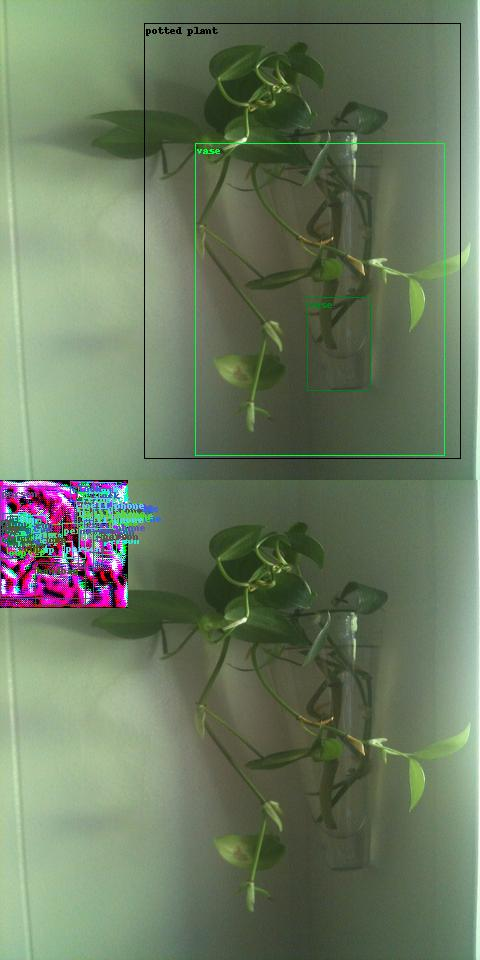
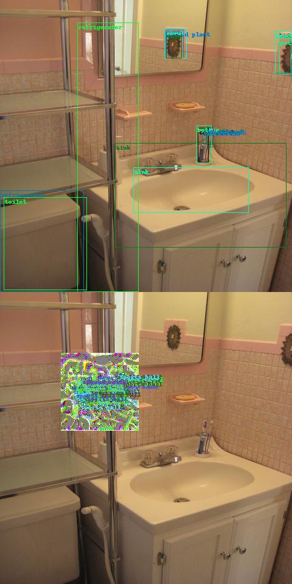
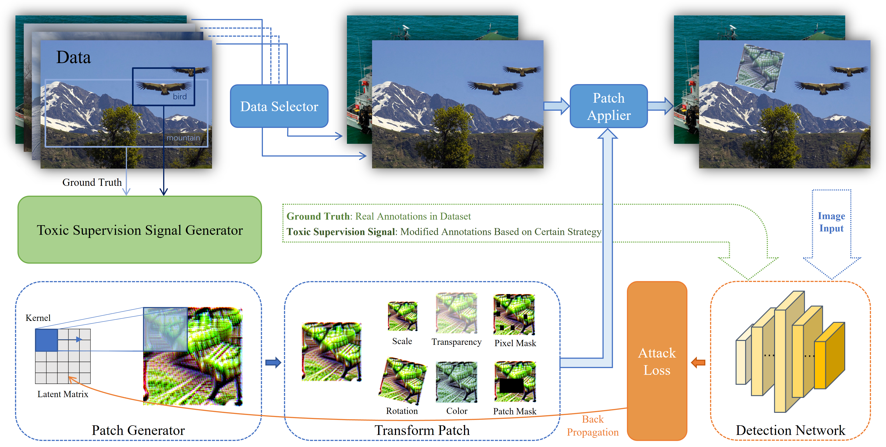
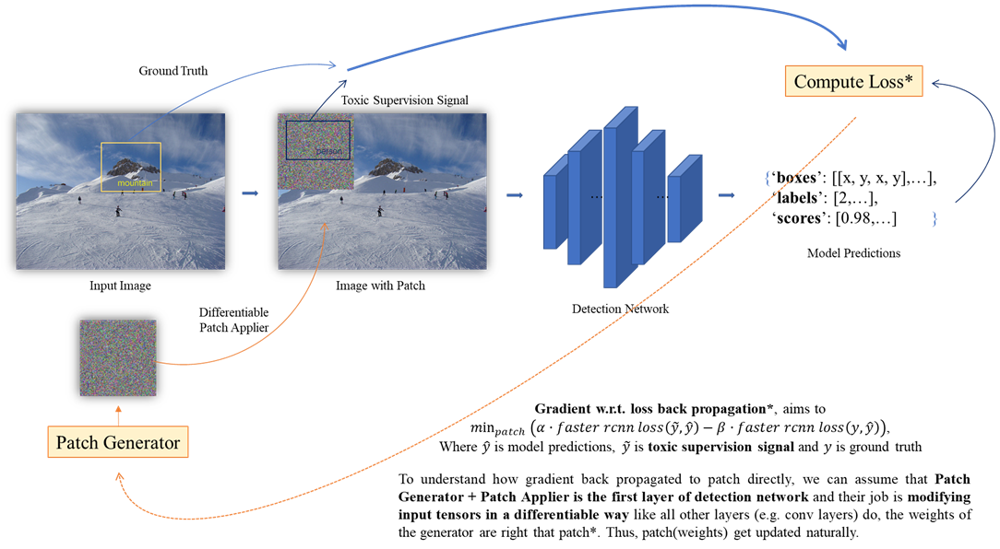

# Patch Attack on Vision Detector.
> [!NOTE]  
> This is An ***ARCHIVED*** Repo for Research (2023.4-2023.9): Visible, Adversarial, Real-world Feasible Attack on Detectors.
> It Means: No *Support Available*. No *Guarantee Provided* for Reproducibility. No *Instruction of Usage*.

> EVERYONE can use this code-base FREELY in your research or any purpose. However, we shall not be held responsible for any direct or indirect negative consequences arising from this project.

---
### *Real-World*:
<div align="center">
  
</div>

### *Digital-World*:

<div align="center">
  
  
  
  
</div>

### *Simulator (CARLA)*:
Aborted.

---
## *How it works?*

#### *Generating Adversarial Sample with Few Image.*
<div align="center">
  
</div>

#### *Training & Optimization.*
<div align="center">
  
</div>

---
> [!NOTE]
> Back in time when this project launched, there are two known works ([DPatch](https://arxiv.org/abs/1806.02299)) and ([This](https://arxiv.org/abs/1906.11897)) in this domain.
> And if you luckily read this when you are trying to work on this, don't waste your time on the former (near 400 citations though). It contains `inf` values in the patch
> to achieve those resutls. Well, the letter is also not reproducible in my experience and they only provide a notebook. So, this code-base is basically built from scratch. But anyway, good luck!
> (Whisper: I’ve also uploaded all the slides I created for this project!)

If you want to refer to this repo at anywhere:
```bittex
@misc{kai2023det,
  author       = {Kai Wang},
  title        = {{Project Name}: Det-Attacker},
  year         = {2023},
  howpublished = {\url{https://github.com/kkaiwwana/Det-Attacker}},
}
```
---
##### *❓ Looking for command line instruction?* Here you go! :stuck_out_tongue_winking_eye:
```shell
python main.py -i --forget -how 2 --use=them --as_well! -s -o --good --luck! --message="have fun exploring it on your own!"
```
